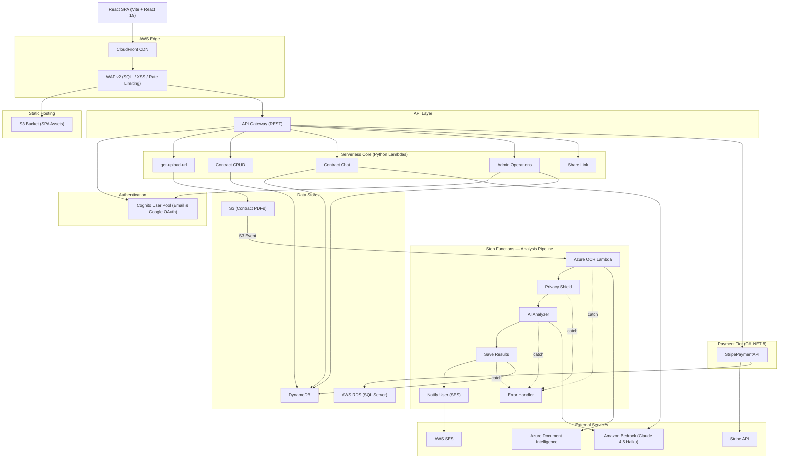
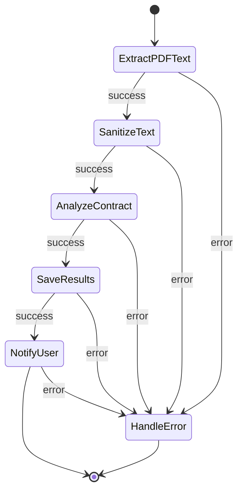
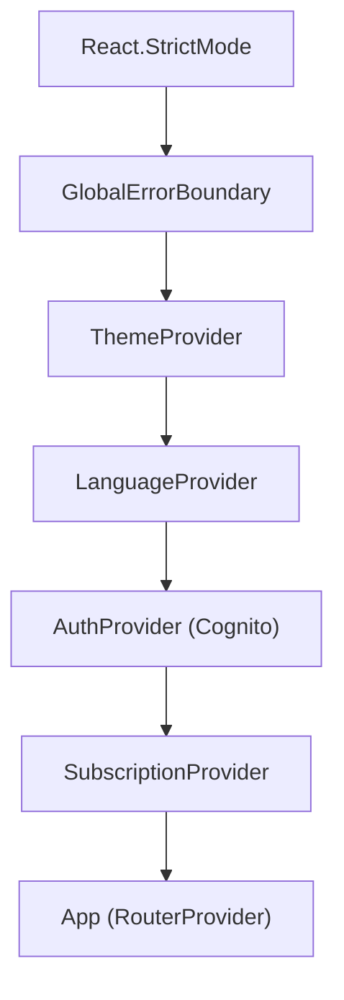
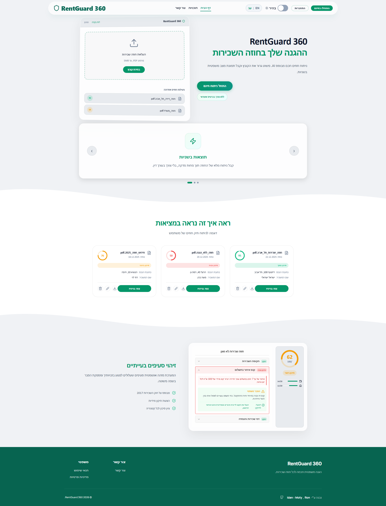
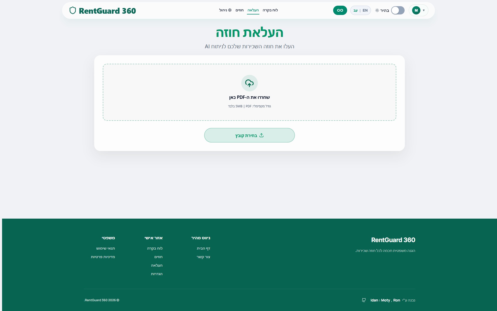
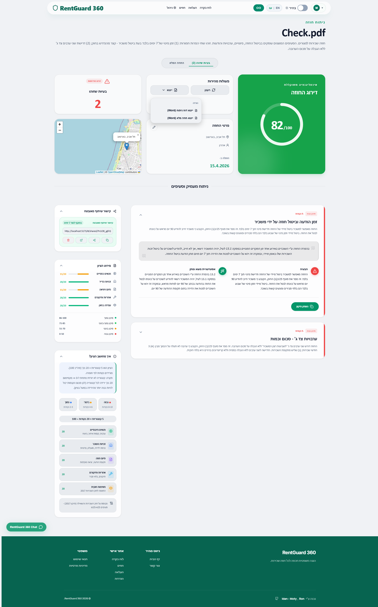
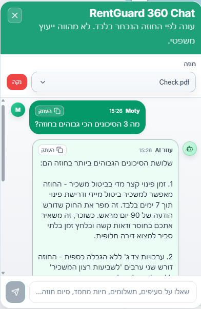
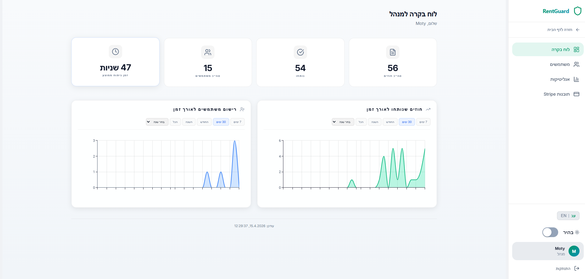
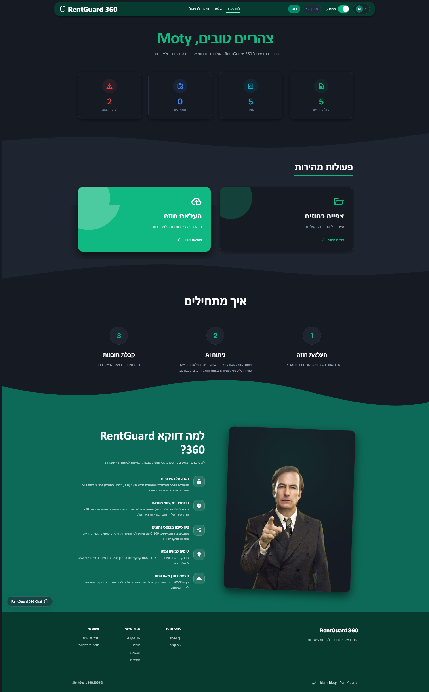

<p align="center">
  
</p>

<h1 align="center">RentGuard 360</h1>

<p align="center">
  <i>AI platform for Israeli rental contract analysis — risk scoring, clause-by-clause review, and negotiation intelligence.</i>
</p>

<p align="center">
  
  
  
  
  
  
</p>

<br />

---

## Table of Contents

- [Overview](#overview)
- [Key Features](#key-features)
- [System Architecture](#system-architecture)
- [Frontend Architecture (React)](#frontend-architecture-react)
  - [Technology Stack](#technology-stack)
  - [Project Structure](#project-structure)
  - [State Management Strategy](#state-management-strategy)
  - [Custom Hooks Architecture](#custom-hooks-architecture)
  - [Routing and Code Splitting](#routing-and-code-splitting)
  - [CSS Architecture and Design System](#css-architecture-and-design-system)
  - [Performance Optimizations](#performance-optimizations)
- [Backend Architecture](#backend-architecture)
  - [Serverless Lambdas (Python)](#serverless-lambdas-python)
  - [C# .NET 8 Payment API](#c-net-8-payment-api-stripepaymentapi)

- [Configuration Reference](#configuration-reference)
- [API Reference](#api-reference)
- [Security Posture](#security-posture)
- [Screenshots](#screenshots)
- [Team and License](#team-and-license)

---

## Overview

### The Problem

Rental contracts in Israel are written in dense legal Hebrew. Risk clauses are buried in fine print, critical protections are often missing entirely, and most renters lack the legal literacy to identify what they can negotiate. No accessible tooling exists to bridge this gap.

### The Solution

RentGuard 360 is a full-stack, serverless AI platform that transforms an opaque PDF lease into an actionable risk report. Users upload a contract and receive a clause-by-clause risk assessment, an overall risk score (0--100), and specific, legally-grounded negotiation recommendations — all within minutes.

### How It Works

1. **Upload** a lease PDF (or scan it with the built-in camera scanner)
2. **Azure Document Intelligence** extracts Hebrew text via OCR
3. **Privacy Shield** strips all personally identifiable information before AI processing
4. **Amazon Bedrock** (Claude 4.5 Haiku) evaluates each clause against Israeli rental law
5. **Interactive dashboard** renders risk scores, flagged clauses, and negotiation suggestions

> [!NOTE]
> The entire analysis pipeline is serverless. No infrastructure to provision or maintain — the system scales from zero to thousands of concurrent analyses via AWS Step Functions, Lambda, and managed services.

---

## Key Features

| Feature | Description | Stack |
|:---|:---|:---|
| Authentication | Secure credential-based login and seamless Google OAuth SSO integration | AWS Cognito, Google Auth |
| Contract Upload | Drag-and-drop PDF ingestion with presigned S3 URLs and server-side scan deduction | React, S3, API Gateway |
| Camera Scanner | Mobile-native document scanning with crop, rotation, and multi-page capture | React Webcam, Canvas API, jsPDF |
| AI Risk Analysis | Clause-by-clause scoring (0--100) grounded in Israeli rental law | Bedrock (Claude 4.5 Haiku), Step Functions |
| Privacy Shield | Regex and NLP-based PII redaction before any AI processing | Python Lambda |
| Contract Chat | Conversational AI assistant scoped to a specific analyzed contract | Bedrock, DynamoDB, React |
| Contract Editor | Inline clause editing with revert-to-original tracking and persistence | React, DynamoDB |
| DOCX Export | Analysis report and edited contract export with full RTL Hebrew support | docx.js, file-saver |
| Share Links | Time-limited, read-only contract sharing via unique URLs | Lambda, DynamoDB |
| Admin Dashboard | User management, system analytics, and Stripe revenue insights | React, MUI X Charts, Cognito Admin APIs |
| Billing and Payments | Scan-pack purchasing with Stripe Checkout integration | C# .NET 8, Stripe.net, AWS RDS |
| Internationalization | Full English / Hebrew UI with automatic RTL layout switching | React Context, CSS logical properties |
| Dark Mode | System-aware theme toggle with CSS custom properties | React Context, CSS variables |

---

## System Architecture

RentGuard 360 is split across three independent compute tiers:

1. **React SPA** — static assets served from S3 via CloudFront
2. **Python Lambdas** — 28 serverless functions handling all core business logic
3. **C# .NET 8 Payment API** — ASP.NET Core Web API deployed as a Lambda for billing



<br />

**Step Functions Orchestration Pipeline:**



> [!IMPORTANT]
> Admin operations (user management, analytics, system stats) require the requesting user to be a member of the Cognito **Admins** group. This is enforced at the AWS IAM level via Cognito group-based authorization, not as an application-level role check.

---

## Frontend Architecture (React)

This section provides an in-depth breakdown of the React architecture — the component hierarchy, state management patterns, custom hooks, routing strategy, CSS methodology, and performance techniques employed throughout the application.

### Technology Stack

| Concern | Technology | Version |
|:---|:---|:---|
| Framework | React | 19.2 |
| Build Tool | Vite | 7.2 |
| Routing | React Router (Hash) | 7.14 |
| State Management | React Context API | -- |
| Animations | Framer Motion | 12.x |
| Icons | Lucide React | 0.556 |
| UI Components | MUI (Admin panels) | 7.x |
| Auth SDK | AWS Amplify | 6.15 |
| Social Login | Google OAuth | -- |
| Payment SDK | Stripe React | 5.6 |
| Charts | MUI X Charts | 8.x |
| Maps | React Leaflet | 5.0 |
| Error Handling | react-error-boundary | 6.1 |
| Notifications | react-hot-toast | 2.6 |
| Camera Scanner | React Webcam | 7.x |
| PDF Generation | jsPDF | 3.x |

### Project Structure

The frontend follows a **feature-sliced architecture**, separating shared UI primitives from domain-specific business logic. Each feature module is self-contained with its own `components/`, `hooks/`, `services/`, and `utils/` directories.

```
src/
├── components/               # Shared, reusable UI primitives
│   ├── layout/               # MainLayout, Navigation, Footer, RouteGuards
│   └── ui/                   # Button, Card, Input, Toggle, Accordion, etc.
│
├── contexts/                 # Global React Context providers
│   ├── AuthContext.jsx        # Cognito session, JWT, admin group detection
│   ├── ThemeContext.jsx       # Dark / light mode toggle
│   ├── SubscriptionContext.jsx # Scan balance, plan status
│   └── LanguageContext/       # EN/HE i18n with RTL direction switching
│       ├── LanguageContext.jsx
│       ├── en.js              # English translation dictionary (~67KB)
│       └── he.js              # Hebrew translation dictionary (~80KB)
│
├── features/                 # Feature-sliced domain modules
│   ├── admin/                # { components, hooks, services, utils }
│   ├── analysis/             # { components, hooks, services, utils }
│   ├── auth/                 # { components, hooks, services, utils }
│   ├── billing/              # { components, hooks, services, utils }
│   ├── chat/                 # { components, hooks, services, utils }
│   ├── contact/              # { components, hooks, services, utils }
│   ├── contracts/            # { components, hooks, services, utils }
│   ├── dashboard/            # { components, hooks, utils }
│   ├── legal/
│   ├── scanner/              # { components, hooks, services, utils }
│   ├── settings/
│   └── upload/               # { components, hooks, services, utils }
│
├── pages/                    # Route-mapped thin page shells
│   ├── admin/                # AdminLayoutPage, AdminDashboardPage, etc.
│   ├── billing/              # PricingPage, CheckoutPage, BillingPage
│   ├── core/                 # DashboardPage, UploadPage, AnalysisPage, etc.
│   ├── legal/                # TermsPage, PrivacyPage
│   └── public/               # LandingPage, NotFoundPage
│
├── services/                 # Centralized API client
│   └── apiClient.js          # Authenticated + public HTTP clients with timeout
│
├── styles/                   # Global design system
│   ├── design-system.css     # token-based design system
│   └── utilities.css         # Utility class overrides
│
├── utils/                    # Shared cross-feature utilities
│   ├── formatUtils.js
│   └── useBodyScrollLock.js
│
├── App.jsx                   # Router bootstrap (thin wrapper)
├── main.jsx                  # Provider composition root
└── router.jsx                # Route definitions + lazy-loaded imports
```

### State Management Strategy

RentGuard 360 uses the **React Context API** as its sole global state management solution — a deliberate architectural decision to minimize bundle size and maintain direct control over re-render boundaries.

**Four Context providers** are composed in `main.jsx` in strict dependency order:



| Provider | Scope | What It Manages |
|:---|:---|:---|
| `ThemeProvider` | Visual | Dark / light mode via CSS `data-theme` attribute on `<html>` |
| `LanguageProvider` | Visual | EN / HE dictionary switching; sets `dir="rtl"` on `<html>` for Hebrew |
| `AuthProvider` | Identity | Cognito session lifecycle, JWT tokens, admin group detection via ID token payload |
| `SubscriptionProvider` | Entitlement | Scan balance, active plan status; depends on `AuthProvider` user identity |

**Feature-local state** is encapsulated within custom hooks. Each feature's hooks manage component-level concerns (form state, loading indicators, optimistic updates) without leaking into global context. This ensures that a state change in the Chat feature does not trigger re-renders in the Upload feature.

### Custom Hooks Architecture

Every non-trivial behavior is extracted into a named custom hook. This pattern keeps page components thin (pure render logic) while colocating related state, effects, and callbacks.

| Hook | Feature | Responsibility |
|:---|:---|:---|
| `useChatWidget` | Chat | Widget open/close state, active contract binding |
| `useChatMessages` | Chat | Message history, optimistic sends, streaming responses |
| `useChatUI` | Chat | Scroll anchoring, auto-resize, pending indicators |
| `useChatContracts` | Chat | Contract list filtering for chat selector |
| `useFetchContracts` | Chat | Shared data-fetching for contract dropdown |
| `useAnalysisPage` | Analysis | Analysis data loading, polling, error/loading states |
| `useContractEditor` | Analysis | Inline clause editing with revert-to-original tracking |
| `useContractShare` | Analysis | Share link generation, revocation, and clipboard copy |
| `useShareFile` | Analysis | DOCX export orchestration with native Web Share API fallback |
| `useSharedAnalysis` | Analysis | Public (unauthenticated) shared contract data fetching |
| `useUpload` | Upload | File validation, presigned URL flow, S3 upload progress |
| `useScanPages` | Scanner | Multi-page scan accumulation and ordering |
| `useScannerUIState` | Scanner | Camera modal lifecycle and UI state |
| `useBodyScrollLock` | Utils | Prevents body scroll when modals are open |

### Routing and Code Splitting

**Hash-based routing** is used via React Router's `createHashRouter`. This is a deliberate choice — the SPA is hosted on S3 behind CloudFront, which serves `index.html` for the root path but returns 404 for deep-linked paths like `/analysis/abc123`. Hash routing (`/#/analysis/abc123`) avoids this entirely without requiring CloudFront error page rewrite rules.

**Every route-level page component is lazy-loaded** via `React.lazy()`, producing 22 independently loadable chunks:

```jsx
const LandingPage = lazy(() => import('@/pages/public/Landing/LandingPage'));
const DashboardPage = lazy(() => import('@/pages/core/DashboardPage'));
const UploadPage = lazy(() => import('@/pages/core/UploadPage'));
// ... 19 more lazy imports
```

**Route guards** enforce access control at the routing layer:

- `ProtectedRoute` — redirects unauthenticated users to the landing page
- `RequireActivePlanRoute` — redirects users without an active subscription to the pricing page
- `ConditionalPricingRoute` / `ConditionalContactRoute` — renders different components based on authentication state (guest vs. user vs. admin)

**Vite manual chunk splitting** optimizes the production bundle via `rollupOptions.manualChunks`:

| Chunk Name | Contents |
|:---|:---|
| `react` | `react`, `react-dom`, `react-router-dom` |
| `mui` | `@mui/material`, `@mui/x-charts`, `@emotion/react`, `@emotion/styled` |
| `amplify` | `aws-amplify` |
| `stripe` | `@stripe/stripe-js`, `@stripe/react-stripe-js` |
| `docx` | `docx` |
| `filesaver` | `file-saver` |
| `icons` | `lucide-react` |

### CSS Architecture and Design System

RentGuard 360 uses **vanilla CSS with a centralized, token-based design system** (`design-system.css`). No CSS framework (Tailwind, Bootstrap, etc.) is used — a deliberate choice for maximum control over visual output and zero runtime CSS overhead.

**Design token categories** defined as CSS custom properties on `:root`:

| Category | Tokens | Example |
|:---|:---|:---|
| Background hierarchy | 3 levels | `--bg-page`, `--bg-card`, `--bg-inset` |
| Text colors | 4 semantic tiers | `--text-primary` through `--text-quaternary` |
| Accent palette | Emerald / teal | `--accent-primary: #059669`, `--accent-secondary: #0891B2` |
| Glassmorphism | 3 tokens | `--glass-bg`, `--glass-border`, `--glass-blur` |
| Shadows | 6-tier scale | `--shadow-xs` through `--shadow-xl` |
| Radius | 6 values | `--radius-xs` (8px) through `--radius-full` (9999px) |
| Spacing | 7-step scale | `--space-xs` (4px) through `--space-3xl` (64px) |
| Typography | System stack | `-apple-system, BlinkMacSystemFont, 'SF Pro Display', 'Inter', ...` |
| Transitions | 4 timing curves | `--transition-fast` (150ms) through `--transition-spring` (400ms) |
| Risk colors | 4 semantic | `--risk-high` (red), `--risk-medium` (amber), `--risk-low` (green), `--risk-neutral` |

**Dark mode** is implemented via a complete `[data-theme="dark"]` variable override block, toggled by `ThemeContext`. Every color token is remapped — the entire UI transitions without any component-level conditional logic.

**RTL support** is built into the CSS architecture using logical properties (`margin-inline`, `padding-inline-start`, etc.) and the `dir="rtl"` attribute set by `LanguageContext`. This eliminates the need for duplicate LTR/RTL stylesheets.

**Component-level CSS** follows a strict co-location pattern: each component maintains its own `.css` file (e.g., `ChatMessage.css`, `ContractCard.css`, `UploadDropzone.css`). This prevents class name collisions and ensures dead CSS is eliminated when components are removed.

### Performance Optimizations

- **Route-level code splitting** — 22 lazy-loaded page chunks via `React.lazy()` and `Suspense`
- **Manual vendor chunking** — 7 named chunks in the Vite build config, ensuring React, MUI, Amplify, and Stripe are cached independently
- **Vite dev-server proxy** — API requests route through `/__rg_api__` and `/__stripe_api__` during local development, eliminating CORS issues without backend configuration changes
- **`React.StrictMode`** — enabled in development for double-render detection and side-effect auditing
- **`GlobalErrorBoundary`** — wraps the entire component tree to intercept unhandled errors and prevent white-screen crashes
- **`RouterErrorElement`** — per-route error boundary for localized crash recovery
- **`AbortController` timeout enforcement** — every API call is wrapped with a configurable timeout (default: 120 seconds) to prevent hanging requests
- **Path aliasing** — `@/` alias via Vite config eliminates deep relative imports across the codebase

---

## Backend Architecture

### Serverless Lambdas (Python)

All core business logic runs as Python Lambda functions triggered by API Gateway or Step Functions. The 28 functions are organized into six logical groups:

**Analysis Pipeline (Step Functions Orchestration)**

| Function | Trigger | Purpose |
|:---|:---|:---|
| `RentGuard_AzureOCR` | Step Functions | Sends uploaded PDF to Azure Document Intelligence for Hebrew OCR extraction |
| `privacy-shield` | Step Functions | Strips PII (names, IDs, phone numbers) from extracted text via regex and NLP patterns |
| `ai-analyzer` | Step Functions | Sends sanitized text to Amazon Bedrock (Claude 4.5 Haiku) for clause-by-clause risk analysis |
| `save-results` | Step Functions | Persists analysis results, risk scores, and recommendations to DynamoDB |
| `notify-user` | Step Functions | Sends email notification to the user via SES when analysis is complete |
| `error-handler` | Step Functions | Catches and logs failures from any pipeline stage; updates contract status |

**Contract Management**

| Function | Trigger | Purpose |
|:---|:---|:---|
| `get-upload-url` | API Gateway | Generates presigned S3 URL for PDF upload; deducts scan credit server-side |
| `get-user-contracts` | API Gateway | Retrieves all contracts belonging to the authenticated user |
| `get-analysis-result` | API Gateway | Fetches analysis results for a specific contract |
| `delete-contract` | API Gateway | Removes contract record, S3 object, and associated analysis data |
| `rename-contract` | API Gateway | Updates the display name of a contract |
| `save-edited-contract` | API Gateway | Persists user-edited clause modifications |
| `create-share-link` | API Gateway | Generates time-limited, read-only sharing URL for a contract |

**Chat System**

| Function | Trigger | Purpose |
|:---|:---|:---|
| `ask-contract-question` | API Gateway | Sends a user question + contract context to Bedrock; returns AI response |
| `get-contract-chat-history` | API Gateway | Retrieves persisted chat history for a contract thread |
| `clear-contract-chat-history` | API Gateway | Deletes all messages in a contract chat thread |
| `consult-clause` | API Gateway | Provides AI consultation on a specific flagged clause |

**User Management (Admin)**

| Function | Trigger | Purpose |
|:---|:---|:---|
| `check-user` | API Gateway | Public endpoint to verify if an email is registered (pre-login flow) |
| `list-users` | API Gateway | Lists all Cognito users with metadata (admin only) |
| `delete-user` | API Gateway | Removes a user from Cognito and all associated data (admin only) |
| `disable-user` | API Gateway | Disables a Cognito user account (admin only) |
| `enable-user` | API Gateway | Re-enables a disabled Cognito user account (admin only) |
| `get-system-stats` | API Gateway | Aggregates platform-wide analytics (admin only) |

**Auth and Lifecycle**

| Function | Trigger | Purpose |
|:---|:---|:---|
| `pre_signup_link_accounts` | Cognito Trigger | Links social login identities to existing email-based accounts |
| `verify_ses_on_login` | Cognito Trigger | Auto-verifies user email in SES on first login |
| `AutoVerifySES` | EventBridge | Scheduled task for SES email verification maintenance |

**Support**

| Function | Trigger | Purpose |
|:---|:---|:---|
| `CreateSupportTicket` | API Gateway | Creates a support ticket via SES email dispatch |

### C# .NET 8 Payment API (`StripePaymentAPI`)

The billing subsystem is a standalone **ASP.NET Core 8 Web API** deployed as an AWS Lambda via `Amazon.Lambda.AspNetCoreServer`. It implements a clean 3-tier architecture:

```
StripePaymentAPI/
├── Controllers/
│   ├── PaymentsController.cs      # Stripe Checkout, webhooks, transaction history
│   └── PackagesController.cs      # Scan package definitions and pricing
├── Services/
│   ├── StripeService.cs           # Stripe SDK integration (sessions, events)
│   ├── SubscriptionService.cs     # Scan balance management, plan entitlements
│   └── PaymentProcessingService.cs # Orchestrates payment lifecycle
├── Repositories/
│   ├── SQLPaymentRepository.cs    # SQL Server data access (ADO.NET)
│   └── SQLAdminStatsRepository.cs # Admin-facing revenue and usage queries
├── Models/
│   ├── Package.cs, Transaction.cs, UserSubscription.cs
│   └── Requests/                  # Request DTOs
├── SQL/
│   ├── 01_CreateTables.sql        # Schema DDL
│   ├── 02_StoredProcedures.sql    # Transactional billing logic
│   └── DeployDB_Full.sql          # Combined deployment script
└── Program.cs                     # DI container, auth middleware, CORS config
```

| Concern | Implementation |
|:---|:---|
| Database | **AWS RDS (SQL Server)** with stored procedures for atomic billing operations |
| Authentication | Cognito JWT validation via `Microsoft.AspNetCore.Authentication.JwtBearer` |
| Server-to-server auth | Internal API key (`X-Internal-Api-Key`) for trusted Lambda-to-API calls |
| Payment provider | Stripe.net SDK (v43.16) for Checkout Sessions, webhooks, and refund handling |
| API documentation | Swagger/OpenAPI via Swashbuckle |

---

## Configuration Reference

### Frontend Environment Variables (`frontend/.env`)

| Variable | Source | Required | Description |
|:---|:---|:---:|:---|
| `VITE_API_ENDPOINT` | Stack `ApiUrl` output | Yes | Base URL for the API Gateway (REST) |
| `VITE_CHECK_USER_API_KEY` | API Gateway Console | Yes | API key for the public `check-user` endpoint |
| `VITE_USER_POOL_ID` | Stack `UserPoolId` output | Yes | Cognito User Pool identifier |
| `VITE_USER_POOL_CLIENT_ID` | Stack `UserPoolClientId` output | Yes | Cognito App Client identifier |
| `VITE_COGNITO_DOMAIN` | Cognito Console | No | OAuth domain for social login flows |
| `VITE_OAUTH_REDIRECT_URI` | CloudFront domain | No | OAuth sign-in redirect (defaults to current origin) |
| `VITE_OAUTH_REDIRECT_OUT_URI` | CloudFront domain | No | OAuth sign-out redirect (defaults to current origin) |
| `VITE_AWS_REGION` | -- | Yes | AWS region (typically `us-east-1`) |
| `VITE_S3_BUCKET` | Stack `ContractsBucketName` output | Yes | S3 bucket for contract PDF storage |
| `VITE_STRIPE_PUBLISHABLE_KEY` | Stripe Dashboard | Yes | Stripe publishable key for client-side Checkout |
| `VITE_STRIPE_API_URL` | Payment API deployment | Yes | Base URL of the C# Stripe Payment API |


---

## API Reference

All endpoints are served through API Gateway. Authentication is handled via Cognito JWT tokens unless noted otherwise. Full Swagger definition available at [`backend/api-gateway/RentGuardAPI-prod-swagger-apigateway.json`](backend/api-gateway/RentGuardAPI-prod-swagger-apigateway.json).

### Contract Endpoints

| Method | Endpoint | Auth | Description |
|:---:|:---|:---:|:---|
| `GET` | `/contracts` | Cognito | List all contracts for the authenticated user |
| `DELETE` | `/contracts` | Cognito | Delete a contract and its associated data |
| `POST` | `/contracts/rename` | Cognito | Update the display name of a contract |
| `POST` | `/contracts/save-edited` | Cognito | Persist clause edits made in the contract editor |
| `POST` | `/contracts/share-link` | Cognito | Generate or manage a time-limited share link |
| `DELETE` | `/contracts/share-link` | Cognito | Revoke an active share link |

### Analysis Endpoints

| Method | Endpoint | Auth | Description |
|:---:|:---|:---:|:---|
| `GET` | `/analysis` | Cognito | Retrieve analysis results for a specific contract |
| `GET` | `/upload` | Cognito | Generate a presigned S3 upload URL (deducts scan credit) |
| `POST` | `/consult` | Cognito | Request AI consultation on a specific clause |

### Chat Endpoints

| Method | Endpoint | Auth | Description |
|:---:|:---|:---:|:---|
| `POST` | `/contract-chat/ask` | Cognito | Send a question about a contract to the AI assistant |
| `GET` | `/contract-chat/history` | Cognito | Retrieve chat history for a contract thread |
| `DELETE` | `/contract-chat/history` | Cognito | Clear all messages in a contract chat thread |

### Admin Endpoints

| Method | Endpoint | Auth | Description |
|:---:|:---|:---:|:---|
| `GET` | `/admin/stats` | Cognito (Admins) | Retrieve platform-wide system statistics |
| `GET` | `/admin/users` | Cognito (Admins) | List all registered users with metadata |
| `POST` | `/admin/users/disable` | Cognito (Admins) | Disable a user account |
| `POST` | `/admin/users/enable` | Cognito (Admins) | Re-enable a disabled user account |
| `DELETE` | `/admin/users/delete` | Cognito (Admins) | Permanently delete a user and all associated data |

### Public Endpoints

| Method | Endpoint | Auth | Description |
|:---:|:---|:---:|:---|
| `GET` | `/auth/check-user` | API Key | Check if an email is registered (pre-login) |
| `POST` | `/public/contact` | None | Submit a contact/support message (guest) |
| `POST` | `/contact` | Cognito | Submit a contact/support message (authenticated) |

---

## Security Posture

| Layer | Implementation |
|:---|:---|
| Authentication | AWS Cognito User Pool with JWT-based session management and Google OAuth |
| Authorization | Group-based RBAC — `Admins` Cognito group gates admin endpoints |
| Edge Protection | CloudFront + WAF v2 rules for SQL injection, XSS, and configurable rate limiting |
| Encryption at Rest | S3 server-side encryption (AES-256) for all stored PDFs |
| PII Protection | Privacy Shield Lambda strips names, IDs, and phone numbers before AI processing |
| Upload Security | Time-limited presigned S3 URLs — no direct bucket access from the client |
| Server-to-Server Auth | Internal API key (`X-Internal-Api-Key`) for trusted Lambda-to-Payment-API calls |
| Secret Management | Zero secrets in the repository — all credentials injected via environment variables |
| Transport | HTTPS-only via CloudFront; API Gateway enforces TLS 1.3 |

---

## Screenshots

<details>
<summary><strong>Landing Page</strong></summary>

<p align="center">
  
</p>

</details>

<details>
<summary><strong>Upload Flow</strong></summary>

<p align="center">
  
</p>

</details>

<details>
<summary><strong>Analysis Dashboard</strong></summary>

<p align="center">
  
</p>

</details>

<details>
<summary><strong>Contract Chat</strong></summary>

<p align="center">
  
</p>

</details>

<details>
<summary><strong>Admin Panel</strong></summary>

<p align="center">
  
</p>

</details>

<details>
<summary><strong>Dark Mode</strong></summary>

<p align="center">
  
</p>

</details>

<br />

<p align="center">
  <a href="https://drvamywirfzyv.cloudfront.net/"><strong>View Live Demo</strong></a>
</p>

---

## Team and License

**Team**: Ron Blanki, Moty Sakhartov, Idan Dahan

**Course**: Advanced React / Cloud Computing, 2026

**License**: This is an academic project. All rights reserved. Copying, redistribution, or reuse of this codebase, in whole or in part, is strictly prohibited without prior written consent from the authors.

